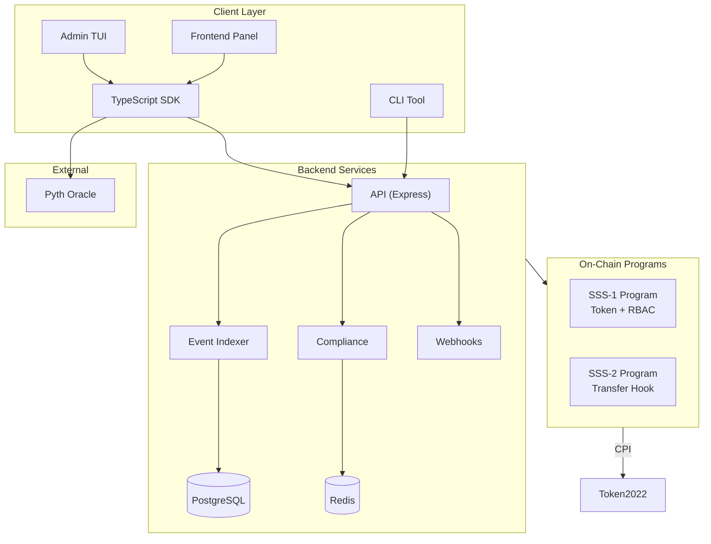

# Solana Stablecoin Standards (SSS-1 + SSS-2 + SSS-3)

[](https://opensource.org/licenses/MIT)
[](https://solana.com)
[](https://www.anchor-lang.com/)
[](https://github.com/yoiioy700/solana-stablecoin-bounty/actions)

Production-ready stablecoin framework using Solana Token-2022. Built from the ground up to support everything from simple internal tokens (SSS-1) to fully regulated, compliance-heavy stablecoins (SSS-2), all the way to privacy-preserving confidential transfers (SSS-3).

## Quick Start

```bash
# Clone
git clone https://github.com/yoiioy700/solana-stablecoin-bounty.git
cd solana-stablecoin-bounty

# Install
npm install

# Test
anchor test

# Deploy to devnet
anchor deploy --provider.cluster devnet
```

## What's inside? (The Presets)

Instead of forcing you to build everything from scratch, I've bundled the features into three main presets you can pick from when initializing your token:

*   **SSS-1 (Minimal)**: Think of this as your standard SPL token but on steroids. It uses Token-2022, has 6 built-in RBAC roles (Master, Minter, Burner, Pauser, etc.), supports mint quotas so your minters don't go rogue, and handles freeze/thaw natively. Perfect for DAO treasuries or internal app tokens.
*   **SSS-2 (Compliant)**: This is for the heavy hitters building regulated stablecoins (like USDC/USDT). It adds a custom Transfer Hook to enforce blacklists/allowlists on *every single transfer*. It also supports transfer fees, a permanent delegate (so admins can seize compromised funds), and defaults to frozen accounts.
*   **SSS-3 (Private)**: The cutting-edge tier. It implements Token-2022's Confidential Transfer extension using ElGamal encryption. Balances and transfer amounts are hidden on-chain. I also threw in an Auditor role so you can stay compliant while offering privacy to your users.

## Architecture



## Project Structure

```
solana-stablecoin-bounty/
├── programs/
│   ├── sss-token/              # SSS-1: RBAC stablecoin
│   └── sss-transfer-hook/      # SSS-2: Transfer hook
├── sdk/
│   └── src/
│       ├── SolanaStablecoin.ts  # Core SDK class
│       ├── ComplianceModule.ts  # SSS-2 compliance
│       ├── RoleManager.ts       # RBAC management
│       ├── MultisigModule.ts    # Multisig governance
│       ├── PrivacyModule.ts     # SSS-3 confidential
│       ├── oracle.ts            # Pyth price feeds
│       ├── sss1.ts / sss2.ts / sss3.ts  # Presets
│       └── index.ts
├── cli/
│   └── src/index.ts             # 13 CLI commands
├── tui/
│   └── src/index.tsx            # Interactive terminal UI (Ink)
├── app/
│   └── index.html               # Admin frontend panel
├── backend/
│   ├── src/api/                 # REST API
│   ├── src/indexer/             # Event listener
│   ├── src/compliance/          # Compliance service
│   ├── src/webhook.ts           # Webhook dispatcher
│   └── docker-compose.yml       # Full stack
├── tests/
│   ├── sss-1.test.ts            # SSS-1 tests
│   ├── sss-2.test.ts            # SSS-2 tests
│   ├── sss2_hook.ts             # Transfer hook tests
│   ├── privacy.test.ts          # SSS-3 tests
│   └── fuzz.test.ts             # Fuzz tests
├── examples/                    # 10 usage examples
├── docs/                        # 14 documentation files
│   ├── ARCHITECTURE.md
│   ├── SSS-1.md / SSS-2.md / SSS-3.md
│   ├── SDK.md / OPERATIONS.md / API.md
│   ├── COMPLIANCE.md / SECURITY.md / PRIVACY.md
│   ├── DEPLOYMENT.md / TESTING.md
│   └── REQUIREMENTS_TRACEABILITY.md
├── deployments/
│   └── devnet.json              # Devnet deployment proof
└── .github/workflows/
    ├── ci.yml                   # 5-job CI pipeline
    └── test.yml                 # Test automation
```

## The Tech Stack

I didn't just build the smart contracts; this is a full end-to-end framework.

### 1. The Smart Contracts (Anchor 0.30.1)
Everything is strictly typed and built on Token-2022. You get role-based access control, minter quotas that reset every epoch, supply caps, batch minting, and multisig governance for those critical state changes. 

For SSS-2, there's a custom Transfer Hook program that intercepts every transfer to enforce your compliance rules (blacklist/whitelist) in real-time. For SSS-3, we leverage the ConfidentialTransferMint extension with Auditor keys.

### 2. The SDK & CLI
You don't want to build transactions by hand. The `@stbr/sss-token` SDK wraps everything up nicely. It handles all the complex PDA derivations and instruction building, plus it hooks into Pyth for oracle price feeds if you need them.

If you're an operator, just use the CLI. It has 13+ commands covering every operation (e.g., `sss-token mint`, `sss-token blacklist add`, `sss-token privacy init`).

### 3. The Backend Stack
If you're running a production stablecoin, you need infrastructure. There's a bundled Express REST API that handles off-chain operations, rate-limiting, and webhook dispatching for 13+ on-chain events. It's fully dockerized and ready to deploy alongside PostgreSQL and Redis.

### 4. Admin Tools
I also threw in an Admin Frontend (Next.js) and a really slick Terminal UI (built with Ink) so you can monitor your stablecoin's pulse directly from your server.

## Devnet Deployment

| Program | ID |
|---|---|
| sss_token | `8JpbyYEJXLeWoPJcLsHWg64bDtwFZXhPoubVJPeH11aH` |
| sss_transfer_hook | `By3BWwxkz7uFMRw1bD63VUnVMysMh79A3A6D58cHaXmB` |

See [docs/DEPLOYMENT.md](./docs/DEPLOYMENT.md) for full deployment guide and tx signatures.

## Usage

### SDK

```typescript
import { SolanaStablecoin, ComplianceModule, SSS2_PRESET } from '@stbr/sss-token';

// Initialize SSS-2 stablecoin
const token = new SolanaStablecoin(connection, wallet);
const { data } = await token.initialize({
  name: 'Regulated USD',
  symbol: 'rUSD',
  decimals: 6,
  authority,
  ...SSS2_PRESET,
});

// Compliance
const compliance = new ComplianceModule(connection);
await compliance.addToBlacklist({
  config: compliance.getConfigPDA(data!.mint),
  authority,
  target: badActor,
  reason: 'Sanctions match',
});
```

### CLI

```bash
yarn cli init --preset sss-2 -n "Regulated USD" -s rUSD -d 6
yarn cli mint <recipient> 1000000 -m <mint>
yarn cli blacklist add <address> -m <mint>
yarn cli status -m <mint>
```

### Admin TUI

```bash
cd tui && npx ts-node src/index.ts <MINT_ADDRESS> --rpc https://api.devnet.solana.com
```

## Testing

```bash
# Full suite
anchor test

# Individual suites
npx ts-mocha -p ./tsconfig.json tests/sss-1.test.ts --timeout 120000
npx ts-mocha -p ./tsconfig.json tests/sss-2.test.ts --timeout 120000
npx ts-mocha -p ./tsconfig.json tests/fuzz.test.ts --timeout 300000
```

See [docs/TESTING.md](./docs/TESTING.md) for complete test guide.

## Documentation

| Document | Description |
|---|---|
| [ARCHITECTURE.md](./docs/ARCHITECTURE.md) | System architecture and flow diagrams |
| [SSS-1.md](./docs/SSS-1.md) | Minimal preset specification |
| [SSS-2.md](./docs/SSS-2.md) | Compliant preset specification |
| [SSS-3.md](./docs/SSS-3.md) | Private preset specification |
| [SDK.md](./docs/SDK.md) | SDK API reference |
| [OPERATIONS.md](./docs/OPERATIONS.md) | CLI operations guide |
| [API.md](./docs/API.md) | REST API reference |
| [COMPLIANCE.md](./docs/COMPLIANCE.md) | Compliance framework |
| [SECURITY.md](./docs/SECURITY.md) | Security model |
| [PRIVACY.md](./docs/PRIVACY.md) | Privacy & confidential transfers |
| [DEPLOYMENT.md](./docs/DEPLOYMENT.md) | Deployment guide |
| [TESTING.md](./docs/TESTING.md) | Testing guide |
| [REQUIREMENTS_TRACEABILITY.md](./docs/REQUIREMENTS_TRACEABILITY.md) | Requirements matrix |

## Security Posture

Security isn't an afterthought here. Every sensitive operation requires role verification. If things go south, there's an emergency `pause` circuit breaker. If an account gets compromised, the permanent delegate extension allows authorized roles to seize and recover funds. Plus, every action emits on-chain events that the webhook dispatcher catches for your audit logs.

## License

MIT License - see [LICENSE](./LICENSE)

## Acknowledgments

- Solana Foundation
- Anchor Framework
- Token-2022 Team
- Pyth Network
- Superteam Brazil
