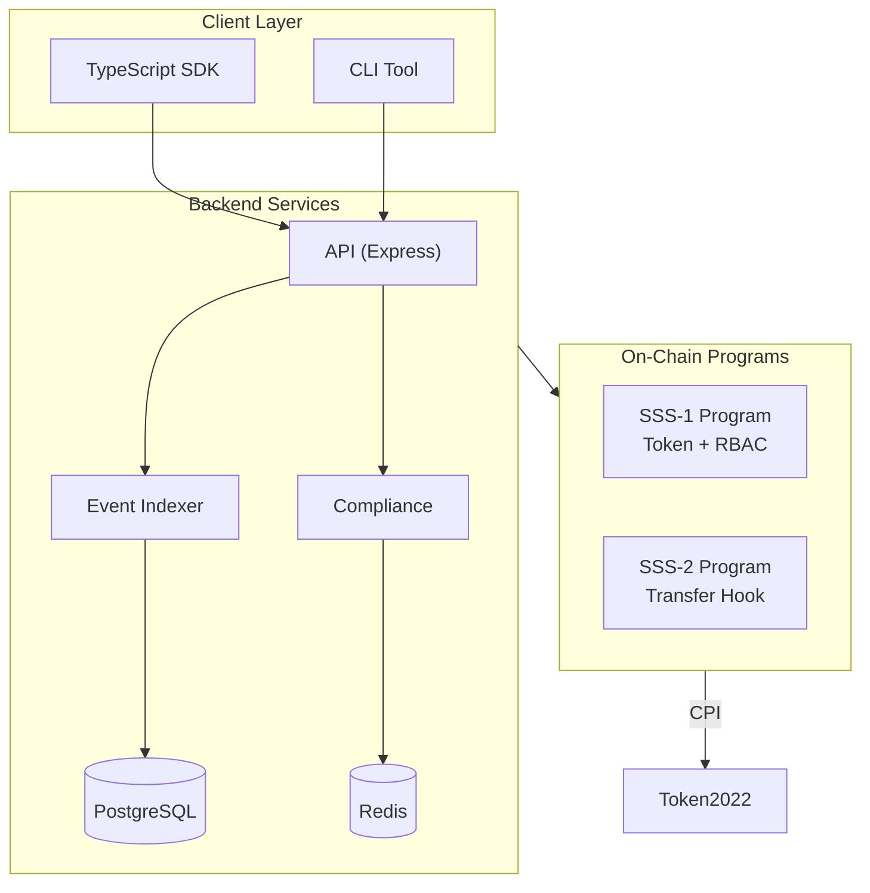

# Solana Stablecoin Standards (SSS-1 + SSS-2)

[](https://opensource.org/licenses/MIT)
[](https://solana.com)
[](https://www.anchor-lang.com/)

Production-ready stablecoin implementation with Role-Based Access Control (SSS-1) and advanced compliance features (SSS-2) using Solana Token-2022 transfer hooks.

## Quick Start

```bash
# Clone repository
git clone https://github.com/yoiioy700/solana-stablecoin-bounty.git
cd solana-stablecoin-bounty

# Install dependencies
npm install

# Run tests
anchor test

# Deploy to devnet
anchor deploy --provider.cluster devnet
```

## Features

### SSS-1: Basic RBAC Stablecoin
- Token-2022 native support
- 6 RBAC roles (Master, Minter, Burner, Pauser, Blacklister, Seizer)
- Role-based mint/burn operations
- Account freeze/thaw
- Emergency pause/unpause
- Minter quotas with overflow protection
- **Supply cap enforcement** (0 = unlimited)
- **Epoch quota with 24h reset**
- **Token-2022 extensions** (MintCloseAuthority, DefaultAccountState)
- **Batch mint** - mint to multiple recipients
- **Multisig governance** - proposal + approval + execute flow

### SSS-2: Compliance Transfer Hook
- Transfer fees (basis points + max cap)
- Whitelist (fee bypass)
- Blacklist enforcement (block transfers)
- Permanent delegate (bypass all restrictions)
- Asset seizure from blacklisted accounts
- Emergency pause
- **Batch blacklist** - batch compliance operations
- 13+ audit event types

### Backend Services (Advanced Infrastructure)
- **PostgreSQL** - production-grade database
- **Redis caching** - high-performance operations
- **3 microservices**: API, Event Indexer, Compliance
- **Docker Compose** - full stack deployment
- **REST API** - comprehensive endpoints

### SDK & CLI
- **4 SDK modules** - SolanaStablecoin, ComplianceModule, RoleManager, MultisigModule
- **Batch operations** - batch_mint, batch_blacklist
- **13 CLI commands** - full operator toolkit
- **10 step-by-step examples** - full feature coverage
- **TypeScript native** - full type safety

## Architecture



## Project Structure

```
solana-stablecoin-bounty/
├── programs/
│   ├── sss-token/              # SSS-1: RBAC stablecoin
│   │   └── src/lib.rs
│   └── sss-transfer-hook/      # SSS-2: Transfer hook
│       └── src/lib.rs
├── sdk/
│   └── src/
│       ├── SolanaStablecoin.ts # Core SSS-1 class
│       ├── ComplianceModule.ts # SSS-2 compliance
│       ├── RoleManager.ts      # RBAC management
│       └── index.ts
├── cli/
│   └── src/index.ts            # 13 CLI commands
├── backend/
│   ├── src/api/                # REST API
│   ├── src/indexer/            # Event listener
│   ├── src/compliance/         # Compliance service
│   └── docker-compose.yml      # Full stack
├── tests/
│   ├── sss-1/                  # SSS-1 tests
│   ├── sss-2/                  # SSS-2 tests
│   └── sdk/                    # SDK tests
├── examples/                   # 5 usage examples
│   ├── 01-basic-sss1.ts
│   ├── 02-minting-with-rbac.ts
│   ├── 03-sss2-compliance.ts
│   ├── 04-lifecycle-upgrade.ts
│   └── 05-emergency-operations.ts
├── docs/                       # 7 documentation files
│   ├── ARCHITECTURE.md
│   ├── SSS-1.md
│   ├── SSS-2.md
│   ├── SDK.md
│   ├── OPERATIONS.md
│   ├── COMPLIANCE.md
│   └── API.md
└── scripts/
    └── demo.sh                 # Terminal demo
```

## Usage Examples

### SDK Example

```typescript
import { SolanaStablecoin, ComplianceModule, RoleManager } from '@stbr/sss-token';

const connection = new Connection('https://api.devnet.solana.com');

// Create SSS-2 stablecoin
const token = new SolanaStablecoin(connection);
const { data } = await token.initialize({
  name: 'My USD',
  symbol: 'MUSD',
  decimals: 6,
  authority,
  enableTransferHook: true,
});

// Setup compliance
const compliance = new ComplianceModule(connection);
await compliance.initialize({
  stablecoin: data!.mint,
  authority,
  transferFeeBasisPoints: 100, // 1%
  maxTransferFee: new BN(1000000000),
  blacklistEnabled: true,
});

// Blacklist bad actor
await compliance.addToBlacklist({
  config: compliance.getConfigPDA(data!.mint),
  authority,
  target: badActor,
  reason: 'Suspicious activity',
});
```

### CLI Example

```bash
# Initialize stablecoin
sss-token init --preset sss-2 --name "My USD" --symbol MUSD

# Grant minter role
sss-token roles grant-minter 7RDzYm... --quota 1000000

# Mint tokens
sss-token mint 7RDzYm... 100000

# Blacklist address
sss-token blacklist add BadActor111111... "Reason"

# Emergency pause
sss-token pause
```

## Testing

```bash
# Run all tests
anchor test

# Run specific suite
cd tests/sss-1 && npx mocha *.test.ts
cd tests/sss-2 && npx mocha *.test.ts
cd tests/sdk && npx mocha *.test.ts

# Run examples
cd examples && npx ts-node 01-basic-sss1.ts
```

## Deployment

### Backend (Docker)

```bash
cd backend
docker-compose up -d
```

Services:
- API: http://localhost:3000
- Compliance: http://localhost:3001
- PostgreSQL: localhost:5432
- Redis: localhost:6379

### Devnet Program

```bash
anchor deploy --provider.cluster devnet
```

## Documentation

- [Architecture Overview](./docs/ARCHITECTURE.md)
- [SSS-1 Specification](./docs/SSS-1.md)
- [SSS-2 Specification](./docs/SSS-2.md)
- [SDK Reference](./docs/SDK.md)
- [Operations Guide](./docs/OPERATIONS.md)
- [Compliance Framework](./docs/COMPLIANCE.md)
- [API Reference](./docs/API.md)

## Security

- All sensitive operations require role verification
- Emergency pause capability
- Permanent delegate for crisis recovery
- Asset seizure from blacklisted accounts
- Comprehensive audit logging

## License

MIT License - see [LICENSE](./LICENSE)

## Acknowledgments

- Solana Foundation
- Anchor Framework
- Token-2022 Team
