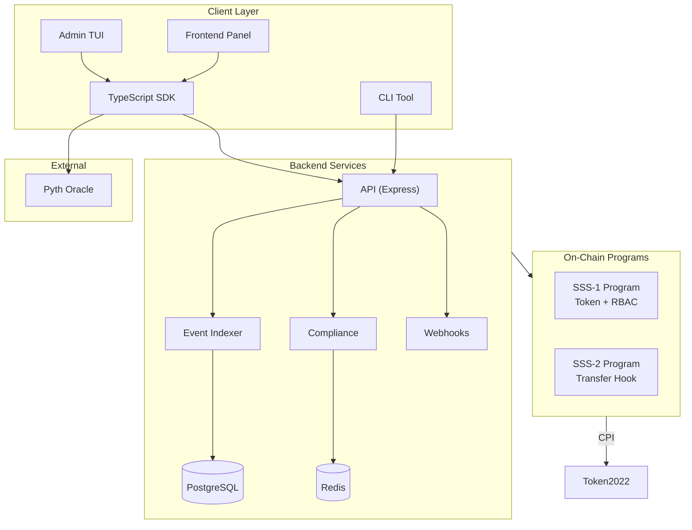

# Solana Stablecoin Standards (SSS-1 + SSS-2 + SSS-3)

[](https://opensource.org/licenses/MIT)
[](https://solana.com)
[](https://www.anchor-lang.com/)
[](https://github.com/yoiioy700/solana-stablecoin-bounty/actions)

Production-ready stablecoin framework with Role-Based Access Control (SSS-1), compliance transfer hooks (SSS-2), and confidential transfers (SSS-3) using Solana Token-2022.

## Quick Start

```bash
# Clone
git clone https://github.com/yoiioy700/solana-stablecoin-bounty.git
cd solana-stablecoin-bounty

# Install
npm install

# Test
anchor test

# Deploy to devnet
anchor deploy --provider.cluster devnet
```

## Preset Comparison

| Feature | SSS-1 (Minimal) | SSS-2 (Compliant) | SSS-3 (Private) |
|---|:---:|:---:|:---:|
| Token-2022 Mint | ✅ | ✅ | ✅ |
| 6 RBAC Roles | ✅ | ✅ | ✅ |
| Mint/Burn + Quotas | ✅ | ✅ | ✅ |
| Freeze/Thaw | ✅ | ✅ | ✅ |
| Pause/Unpause | ✅ | ✅ | ✅ |
| Batch Mint | ✅ | ✅ | ✅ |
| Multisig Governance | ✅ | ✅ | ✅ |
| Transfer Hook | ❌ | ✅ | ✅ |
| Blacklist | ❌ | ✅ | ✅ |
| Transfer Fees | ❌ | ✅ | ✅ |
| Permanent Delegate | ❌ | ✅ | ✅ |
| Asset Seizure | ❌ | ✅ | ✅ |
| Confidential Transfers | ❌ | ❌ | ✅ |
| Allowlist | ❌ | ❌ | ✅ |
| Default Frozen | ❌ | ❌ | ✅ |

## Architecture



## Project Structure

```
solana-stablecoin-bounty/
├── programs/
│   ├── sss-token/              # SSS-1: RBAC stablecoin
│   └── sss-transfer-hook/      # SSS-2: Transfer hook
├── sdk/
│   └── src/
│       ├── SolanaStablecoin.ts  # Core SDK class
│       ├── ComplianceModule.ts  # SSS-2 compliance
│       ├── RoleManager.ts       # RBAC management
│       ├── MultisigModule.ts    # Multisig governance
│       ├── PrivacyModule.ts     # SSS-3 confidential
│       ├── oracle.ts            # Pyth price feeds
│       ├── sss1.ts / sss2.ts / sss3.ts  # Presets
│       └── index.ts
├── cli/
│   └── src/index.ts             # 13 CLI commands
├── tui/
│   └── src/index.tsx            # Interactive terminal UI (Ink)
├── app/
│   └── index.html               # Admin frontend panel
├── backend/
│   ├── src/api/                 # REST API
│   ├── src/indexer/             # Event listener
│   ├── src/compliance/          # Compliance service
│   ├── src/webhook.ts           # Webhook dispatcher
│   └── docker-compose.yml       # Full stack
├── tests/
│   ├── sss-1.test.ts            # SSS-1 tests
│   ├── sss-2.test.ts            # SSS-2 tests
│   ├── sss2_hook.ts             # Transfer hook tests
│   ├── privacy.test.ts          # SSS-3 tests
│   └── fuzz.test.ts             # Fuzz tests
├── examples/                    # 10 usage examples
├── docs/                        # 14 documentation files
│   ├── ARCHITECTURE.md
│   ├── SSS-1.md / SSS-2.md / SSS-3.md
│   ├── SDK.md / OPERATIONS.md / API.md
│   ├── COMPLIANCE.md / SECURITY.md / PRIVACY.md
│   ├── DEPLOYMENT.md / TESTING.md
│   └── REQUIREMENTS_TRACEABILITY.md
├── deployments/
│   └── devnet.json              # Devnet deployment proof
└── .github/workflows/
    ├── ci.yml                   # 5-job CI pipeline
    └── test.yml                 # Test automation
```

## Key Features

### On-Chain Programs
- **Token-2022 native** with MintCloseAuthority, DefaultAccountState extensions
- **6 RBAC roles**: Master, Minter, Burner, Pauser, Blacklister, Seizer
- **Minter quotas** with overflow protection and 24h epoch reset
- **Supply cap** enforcement (0 = unlimited)
- **Batch mint** to multiple recipients
- **Multisig governance** — proposal → approval → execute flow
- **Transfer hook** — blacklist/allowlist enforcement on every transfer
- **Transfer fees** — basis points + max cap
- **Permanent delegate** — bypass restrictions for crisis recovery
- **Asset seizure** from blacklisted accounts
- **Confidential transfers** — Token-2022 ConfidentialTransferMint + auditor key (SSS-3)

### SDK & CLI
- **5 SDK modules** — SolanaStablecoin, ComplianceModule, RoleManager, MultisigModule, PrivacyModule
- **Oracle module** — Pyth price feed integration (USD/token conversions)
- **13 CLI commands** — full operator toolkit with preset selection
- **10 examples** — step-by-step coverage of all features
- **TypeScript native** — full type safety

### Backend Services
- **3 microservices**: API (Express), Event Indexer, Compliance
- **Webhook dispatcher** — HMAC signed, retry with backoff, 15 event types
- **PostgreSQL** + **Redis** caching
- **Docker Compose** — one-command deployment

### Bonus Features
- **Admin TUI** — Interactive terminal dashboard (Ink/React) with 6 screens
- **Admin Frontend** — Modern dark-themed web panel with wallet connect
- **Fuzz tests** — Edge case and boundary testing

## Devnet Deployment

| Program | ID |
|---|---|
| sss_token | `b3AxhgSuNvjsv2F4XmuXYJbBCRcTT1XPXQvRe77NbrK` |
| sss_transfer_hook | `FSkkSmrThcLpU9Uybrn4xcpbQKswUJn7KvoUQBsLPExD` |

See [docs/DEPLOYMENT.md](./docs/DEPLOYMENT.md) for full deployment guide and tx signatures.

## Usage

### SDK

```typescript
import { SolanaStablecoin, ComplianceModule, SSS2_PRESET } from '@stbr/sss-token';

// Initialize SSS-2 stablecoin
const token = new SolanaStablecoin(connection, wallet);
const { data } = await token.initialize({
  name: 'Regulated USD',
  symbol: 'rUSD',
  decimals: 6,
  authority,
  ...SSS2_PRESET,
});

// Compliance
const compliance = new ComplianceModule(connection);
await compliance.addToBlacklist({
  config: compliance.getConfigPDA(data!.mint),
  authority,
  target: badActor,
  reason: 'Sanctions match',
});
```

### CLI

```bash
yarn cli init --preset sss-2 -n "Regulated USD" -s rUSD -d 6
yarn cli mint <recipient> 1000000 -m <mint>
yarn cli blacklist add <address> -m <mint>
yarn cli status -m <mint>
```

### Admin TUI

```bash
cd tui && npx ts-node src/index.ts <MINT_ADDRESS> --rpc https://api.devnet.solana.com
```

## Testing

```bash
# Full suite
anchor test

# Individual suites
npx ts-mocha -p ./tsconfig.json tests/sss-1.test.ts --timeout 120000
npx ts-mocha -p ./tsconfig.json tests/sss-2.test.ts --timeout 120000
npx ts-mocha -p ./tsconfig.json tests/fuzz.test.ts --timeout 300000
```

See [docs/TESTING.md](./docs/TESTING.md) for complete test guide.

## Documentation

| Document | Description |
|---|---|
| [ARCHITECTURE.md](./docs/ARCHITECTURE.md) | System architecture and flow diagrams |
| [SSS-1.md](./docs/SSS-1.md) | Minimal preset specification |
| [SSS-2.md](./docs/SSS-2.md) | Compliant preset specification |
| [SSS-3.md](./docs/SSS-3.md) | Private preset specification |
| [SDK.md](./docs/SDK.md) | SDK API reference |
| [OPERATIONS.md](./docs/OPERATIONS.md) | CLI operations guide |
| [API.md](./docs/API.md) | REST API reference |
| [COMPLIANCE.md](./docs/COMPLIANCE.md) | Compliance framework |
| [SECURITY.md](./docs/SECURITY.md) | Security model |
| [PRIVACY.md](./docs/PRIVACY.md) | Privacy & confidential transfers |
| [DEPLOYMENT.md](./docs/DEPLOYMENT.md) | Deployment guide |
| [TESTING.md](./docs/TESTING.md) | Testing guide |
| [REQUIREMENTS_TRACEABILITY.md](./docs/REQUIREMENTS_TRACEABILITY.md) | Requirements matrix |

## Security

- All sensitive operations require role verification
- Emergency pause capability
- Permanent delegate for crisis recovery
- Asset seizure from blacklisted accounts
- HMAC-signed webhooks with idempotency
- Comprehensive audit logging (13+ event types)

## License

MIT License - see [LICENSE](./LICENSE)

## Acknowledgments

- Solana Foundation
- Anchor Framework
- Token-2022 Team
- Pyth Network
- Superteam Brazil
