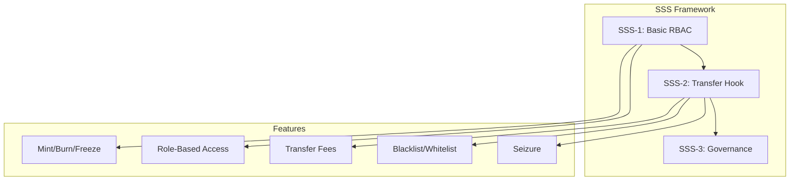
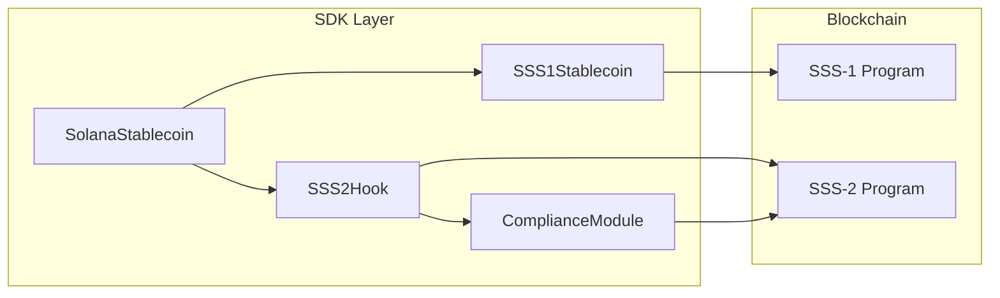
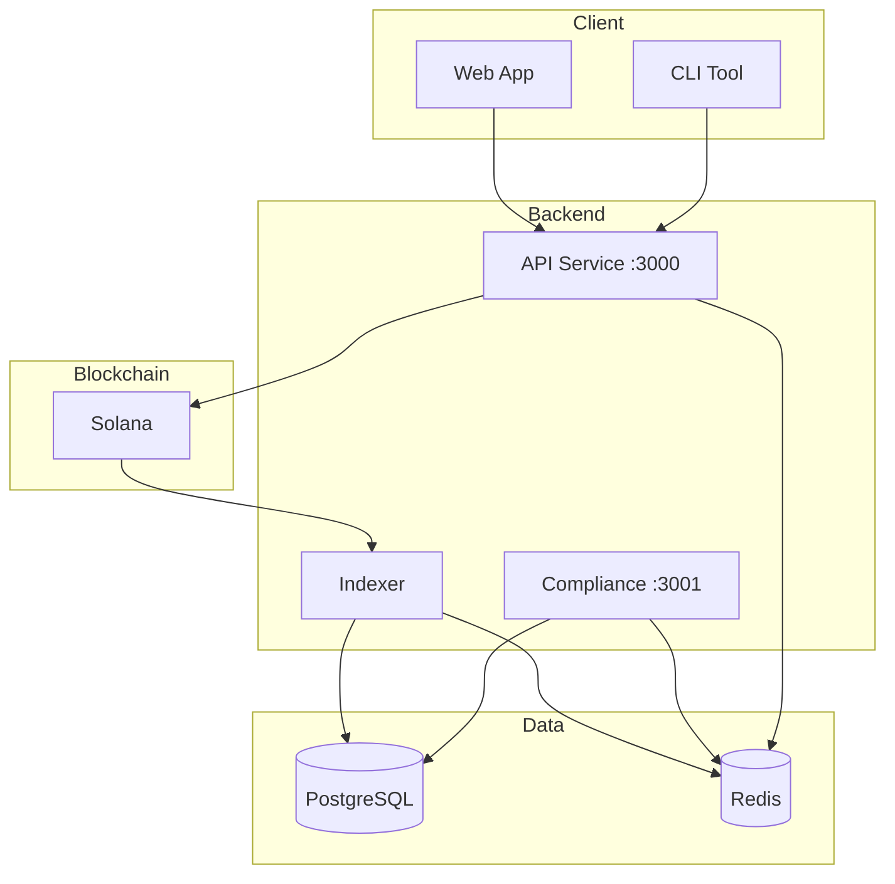
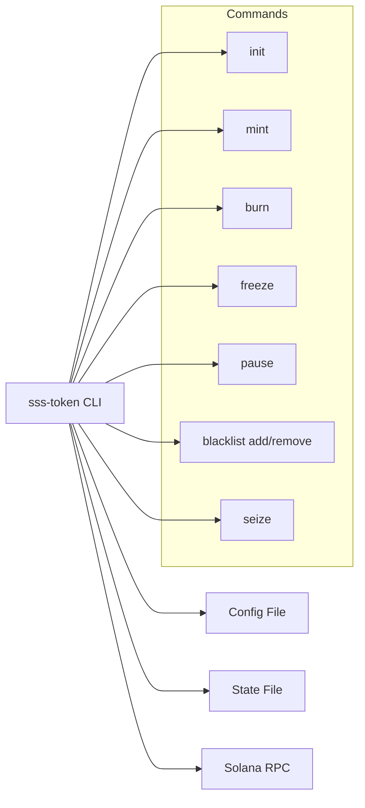
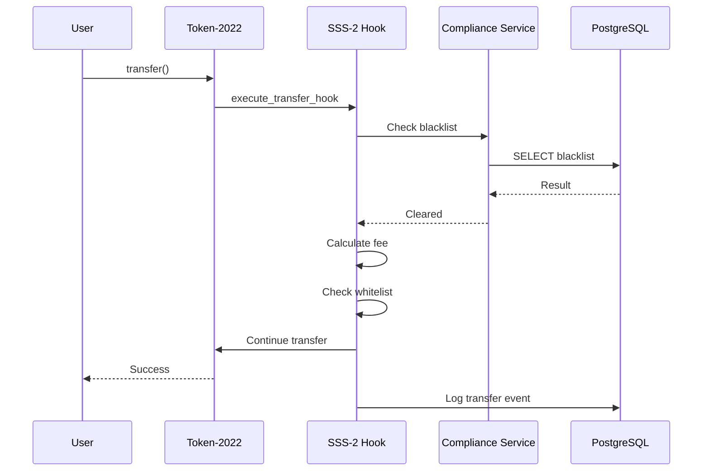
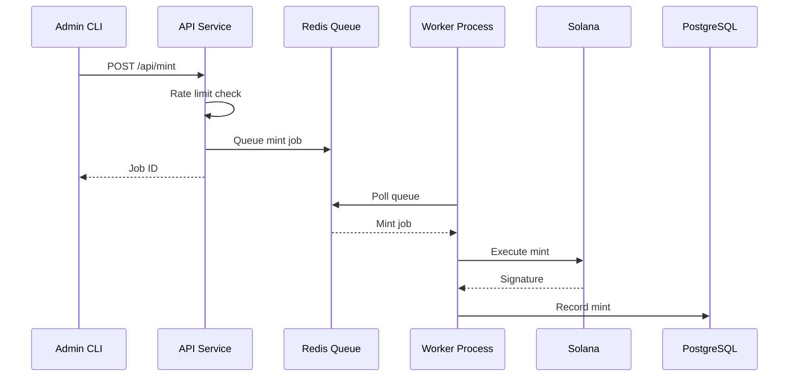
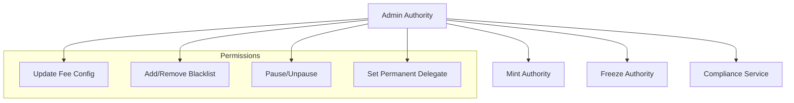

# SSS Token Architecture

## Overview

Solana Stablecoin Standards (SSS) is a modular framework for creating compliant stablecoins on Solana. It consists of three progressive standards that build upon each other.



## System Components

### 1. On-Chain Programs

#### SSS-1: RBAC Stablecoin
- **Purpose**: Basic stablecoin with role-based access control
- **Features**: Mint, burn, freeze, role management
- **Accounts**: Mint, Token accounts, Role assignments

#### SSS-2: Transfer Hook
- **Purpose**: Advanced compliance with transfer hooks
- **Features**: Fees, blacklist, whitelist, permanent delegate, seizure
- **Program ID**: `FSkkSmrThcLpU9Uybrn4xcpbQKswUJn7KvoUQBsLPExD` (Devnet)
- **PDAs**:
  - Config: `["config", authority]`
  - Whitelist: `["whitelist", authority, address]`
  - Blacklist: `["blacklist", authority, address]`

### 2. TypeScript SDK



**Core Classes**:
- `SolanaStablecoin`: Main entry point, factory pattern
- `SSS1Stablecoin`: RBAC operations
- `SSS2Hook`: Transfer hook compliance

### 3. Backend Services



#### API Service (Port 3000)
- **Purpose**: Mint/burn operations with rate limiting
- **Stack**: Express.js, Solana web3
- **Endpoints**:
  - `POST /api/mint` - Queue mint transaction
  - `POST /api/burn` - Queue burn transaction
  - `GET /api/mint/queue` - View pending operations

#### Indexer Service
- **Purpose**: Event listener and database sync
- **Syncs**: Transfers, fee updates, blacklist/whitelist changes
- **Tables**: `transfers`, `fee_updates`, `blacklist_events`, `whitelist_events`

#### Compliance Service (Port 3001)
- **Purpose**: Pre-transaction compliance checks
- **Endpoints**:
  - `POST /check/blacklist` - Check blacklist status
  - `POST /check/whitelist` - Check whitelist status
  - `POST /check/transfer` - Full compliance check
  - `POST /check/batch` - Batch compliance check

### 4. Admin CLI



## Data Flow

### Transfer Flow (SSS-2)



### Mint Flow



## Security Model

### Role Hierarchy



### Compliance Checks

1. **Blacklist**: Source/destination must not be blacklisted
2. **Whitelist**: Whitelisted addresses bypass fees
3. **Permanent Delegate**: Bypasses all restrictions
4. **Pause**: Emergency stop all transfers
5. **Fee Limits**: Max 10% fee cap

## Deployment Architecture

### Devnet

```
┌─────────────────────────────────────┐
│           Devnet Cluster            │
│  ┌───────────────────────────────┐  │
│  │  SSS-2 Program                │  │
│  │  FSkkSmrThcLp...              │  │
│  └───────────────────────────────┘  │
└─────────────────────────────────────┘
              │
              │ RPC
              ▼
┌─────────────────────────────────────┐
│         Backend Services            │
│  ┌─────┐ ┌─────┐ ┌─────────────┐  │
│  │ API │ │ IDX │ │ Compliance  │  │
│  │ :3000  │ │     │ │     :3001   │  │
│  └─────┘ └─────┘ └─────────────┘  │
│  ┌─────┐ ┌─────────────────────┐ │
│  │Redis│ │     PostgreSQL       │ │
│  └─────┘ └─────────────────────┘ │
└─────────────────────────────────────┘
```

### Mainnet (Future)

- Multi-sig authority
- Timelock for critical operations
- Monitoring and alerting

## Technology Stack

| Layer | Technology |
|-------|------------|
| Blockchain | Solana, Token-2022 |
| Program | Rust, Anchor 0.30.1 |
| SDK | TypeScript, @coral-xyz/anchor |
| CLI | Node.js, Commander.js |
| API | Express.js, Solana Web3 |
| Database | PostgreSQL 15 |
| Cache | Redis 7 |
| Container | Docker, Docker Compose |

## Scaling Considerations

### Current (Devnet)
- Single authority
- SQLite/file-based state (CLI)
- In-memory rate limiting

### Future (Mainnet)
- Multi-sig governance
- Distributed database
- Redis Cluster
- Horizontal scaling with load balancers

## References

- [SSS-1 Specification](./SSS-1.md)
- [SSS-2 Specification](./SSS-2.md)
- [SDK Documentation](./SDK.md)
- [Operations Guide](./OPERATIONS.md)
- [Compliance Guide](./COMPLIANCE.md)
- [API Reference](./API.md)
