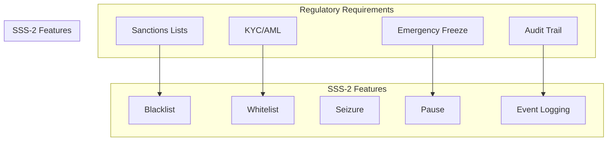
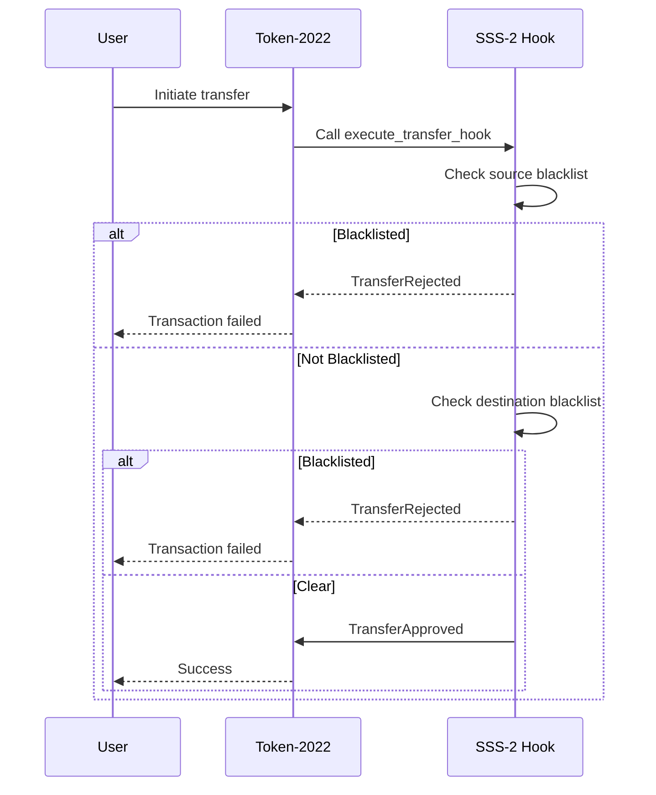
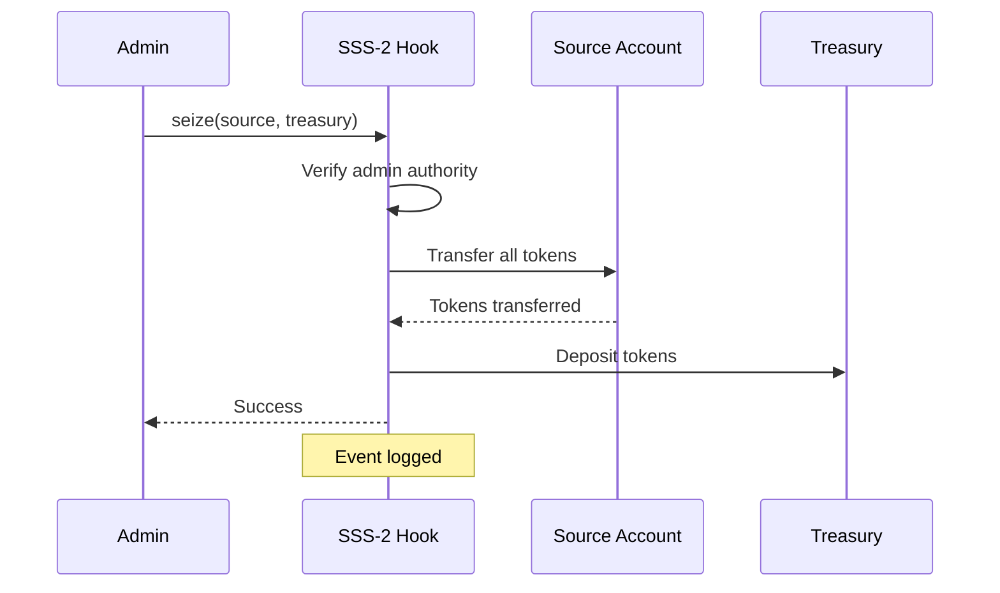

# Compliance Guide

## Overview

SSS Token provides comprehensive compliance features for regulated stablecoins, including blacklist enforcement, seizure capabilities, and audit trails.

## Compliance Framework



## Blacklist Enforcement

### Purpose
Block transfers from/to sanctioned or prohibited addresses.

### How It Works



### Admin Operations

```bash
# Add address to blacklist
sss-token blacklist add <address>

# Remove from blacklist
sss-token blacklist remove <address>

# Enable/disable enforcement
sss-token config --enable-blacklist
sss-token config --disable-blacklist
```

### SDK

```typescript
// Add to blacklist
await hook.addBlacklist(sanctionedAddress);

// Check status
const isBlacklisted = await complianceService.checkBlacklist(address);

// Get blacklist
const blacklist = await complianceService.getBlacklist();
```

## Whitelist

### Purpose
Bypass fees for verified/KYC addresses.

### How It Works

Whitelisted addresses skip fee calculation:
```
if whitelisted:
    fee = 0
else:
    fee = calculate_fee(amount)
```

### Admin Operations

```bash
# Add to whitelist
sss-token whitelist <address>

# Remove from whitelist
sss-token whitelist --remove <address>
```

### SDK

```typescript
// Add to whitelist
await hook.addWhitelist(kycVerifiedAddress);

// Check status
const isWhitelisted = await complianceService.checkWhitelist(address);
```

## Seizure

### Purpose
Recover funds from bad actors or frozen accounts.

### How It Works



### Admin Operations

```bash
# Seize tokens
sss-token seize <address> --to <treasury>

# Seize with amount
sss-token seize <address> --amount 1000000 --to <treasury>
```

### SDK

```typescript
// Seize all tokens
await hook.seize({
  from: badActorAddress,
  to: treasuryAddress,
});

// Seize specific amount
await hook.seize({
  from: badActorAddress,
  to: treasuryAddress,
  amount: new BN(1000000),
});
```

## Emergency Controls

### Pause

Emergency stop all transfers.

```bash
# Pause all transfers
sss-token pause

# Resume transfers
sss-token unpause
```

```typescript
// Emergency pause
await hook.setPaused(true);

// Resume
await hook.setPaused(false);
```

### Permanent Delegate

Super-user that bypasses all restrictions.

```bash
# Set permanent delegate
sss-token config --permanent-delegate <address>

# Clear delegate
sss-token config --clear-delegate
```

```typescript
// Set
await hook.setPermanentDelegate(treasuryAddress);

// Clear
await hook.setPermanentDelegate(undefined);
```

## Regulatory Reporting

### Event Logging

All compliance actions are logged:

| Event | Logged Data |
|-------|-------------|
| Transfer | Source, destination, amount, fee, timestamp |
| Blacklist Add | Address, admin, timestamp |
| Blacklist Remove | Address, admin, timestamp |
| Seizure | Source, destination, amount, timestamp |
| Pause/Unpause | Admin, timestamp |

### Database Schema

See [API.md](./API.md) for full database schema.

### Query Examples

```sql
-- Recent transfers
SELECT * FROM transfers 
ORDER BY created_at DESC 
LIMIT 100;

-- Blacklist activity
SELECT * FROM blacklist_events 
WHERE action = 'add' 
AND created_at > NOW() - INTERVAL '30 days';

-- Seizure report
SELECT * FROM transfers 
WHERE source IN (
  SELECT address FROM blacklist_events WHERE action = 'add'
)
AND amount > 1000000;
```

## Integration Guide

### Sanctions Lists

Integrate with OFAC, UN sanctions:

```typescript
// Fetch sanctions list
const sanctionedAddresses = await fetchSanctionsList();

// Sync to blacklist
for (const address of sanctionedAddresses) {
  await hook.addBlacklist(new PublicKey(address));
}
```

### KYC Verification

```typescript
// After KYC passes
app.post('/kyc/approve', async (req, res) => {
  const { address } = req.body;
  
  await hook.addWhitelist(new PublicKey(address));
  
  res.json({ success: true });
});
```

### Compliance API

Use compliance service for pre-transaction checks:

```typescript
const check = await axios.post('http://localhost:3001/check/transfer', {
  source: fromAddress,
  destination: toAddress,
  amount: amount.toString(),
});

if (!check.data.data.isCompliant) {
  throw new Error('Transfer blocked by compliance');
}

// Proceed with transfer
await token.transfer({ to: toAddress, amount });
```

## Audit Trail

### Transaction Events

```rust
pub struct TransferHookEvent {
    pub source: Pubkey,           // From address
    pub destination: Pubkey,     // To address
    pub amount: u64,              // Transfer amount
    pub fee: u64,                 // Fee charged
    pub is_delegate_transfer: bool, // Bypass flag
    pub timestamp: i64,             // Unix timestamp
}
```

### Admin Events

```rust
pub struct ListEntryAdded {
    pub address: Pubkey,       // Added address
    pub entry_type: ListType,  // Whitelist/Blacklist
    pub added_by: Pubkey,      // Admin
    pub timestamp: i64,        // When
}
```

### Indexing

Indexer stores all events in PostgreSQL:

```typescript
// Indexer config
const eventTypes = [
  'TransferHookEvent',
  'ListEntryAdded',
  'ListEntryRemoved',
  'FeeConfigUpdated',
  'PermanentDelegateUpdated',
];

// Subscribe to program
indexer.subscribeToProgram(SSS2_PROGRAM_ID, eventTypes);
```

## Best Practices

### 1. Multi-Sig for Critical Operations

```bash
# Use Squads multisig
squads create --members admin1,admin2,admin3 --threshold 2
```

### 2. Regular Blacklist Updates

```bash
# Cron job
0 0 * * * /usr/local/bin/update-blacklist.sh
```

### 3. Monitoring

Set alerts for:
- Large blacklist additions (>10)
- Emergency pause events
- Failed compliance checks (>50/hour)
- Seizure events

### 4. Backup and Recovery

```bash
# Daily backup
docker exec sss-postgres pg_dump -U sss sss_token > backup.sql

# Store offsite
aws s3 cp backup.sql s3://sss-backups/
```

## Jurisdiction Support

### US (OFAC)

```typescript
const usConfig = {
  sanctionsSource: 'OFAC_SDN',
  updateFrequency: 'daily',
  emergencyFreeze: true,
};
```

### EU (EU Sanctions)

```typescript
const euConfig = {
  sanctionsSource: 'EU_CONSOLIDATED',
  gdprCompliance: true,
  rightToData: true,
};
```

### Custom

```typescript
const customConfig = {
  sanctionsSource: ['custom_list_1', 'custom_list_2'],
  freezeThreshold: 10000, // Auto-freeze over $10k
};
```

## Legal Considerations

### Terms of Service

Required disclosures:
- Blacklist policy
- Seizure conditions
- User data retention
- Compliance obligations

### Privacy

- Store minimal identifiable data
- Use hashed addresses where possible
- Implement data retention limits

### Licensing

SSS Token is MIT licensed. Compliance features are:
- Optional to use
- Configurable per jurisdiction
- Auditable

## Testing

### Compliance Tests

```typescript
describe('Compliance', () => {
  it('should block blacklisted addresses', async () => {
    await hook.addBlacklist(badActor);
    
    const result = await transferFrom(badActor);
    expect(result.success).to.be.false;
    expect(result.error).to.include('blacklisted');
  });
  
  it('should bypass fees for whitelisted', async () => {
    await hook.addWhitelist(kycUser);
    
    const fee = hook.calculateFee(amount, config);
    expect(fee.fee.toNumber()).to.equal(0);
  });
});
```

## References

- [SSS-2 Specification](./SSS-2.md)
- [Operations Guide](./OPERATIONS.md)
- [Architecture Overview](./ARCHITECTURE.md)
- OFAC Sanctions: https://sanctions.ofac.treas.gov
- FATF Guidelines: https://www.fatf-gafi.org
