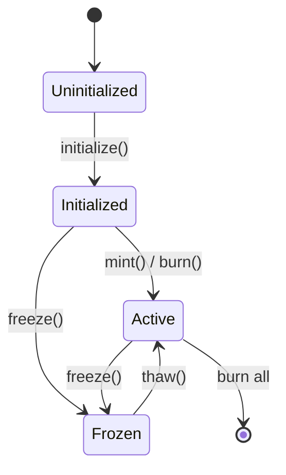
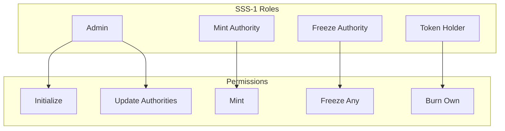
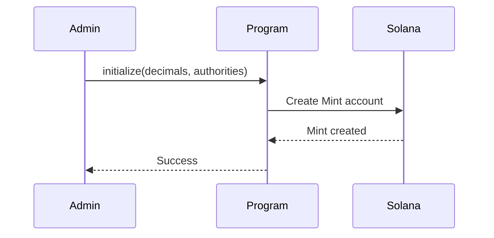
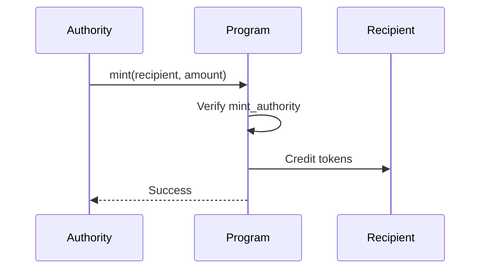
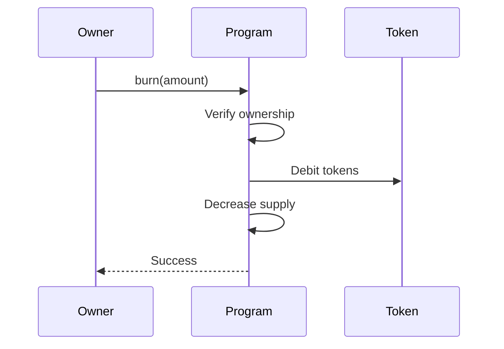
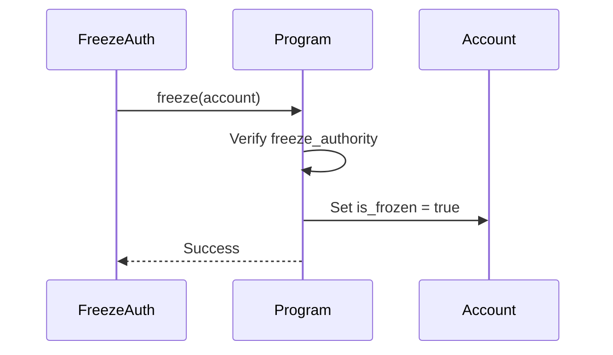

# SSS-1: Basic RBAC Stablecoin

## Overview

SSS-1 is the foundational standard for Solana stablecoins. It provides basic role-based access control (RBAC) for mint, burn, and freeze operations.

## Features

- ✅ Mint tokens to any account
- ✅ Burn tokens from owned accounts
- ✅ Freeze/unfreeze accounts
- ✅ Role-based access control
- ✅ Multi-signature support (optional)

## Program Structure

### Instructions

| Instruction | Description | Authority Required |
|-------------|-------------|-------------------|
| `initialize` | Create stablecoin mint | Signer |
| `mint` | Mint tokens | Mint Authority |
| `burn` | Burn tokens | Owner or Burn Authority |
| `freeze` | Freeze account | Freeze Authority |
| `thaw` | Unfreeze account | Freeze Authority |
| `update_authority` | Change authorities | Current Authority |

### Accounts

```
Mint Account
├── mint_authority: Pubkey    (can mint)
├── freeze_authority: Pubkey  (can freeze/thaw)
├── supply: u64               (total supply)
├── decimals: u8              (decimals)
└── is_initialized: bool      (status)
```

## State Machine



## Data Structures

### InitializeArgs
```rust
pub struct InitializeArgs {
    pub decimals: u8,                    // Token decimals (default: 6)
    pub mint_authority: Pubkey,         // Initial mint authority
    pub freeze_authority: Option<Pubkey>, // Optional freeze authority
}
```

### MintArgs
```rust
pub struct MintArgs {
    pub recipient: Pubkey,  // Account to mint to
    pub amount: u64,        // Amount to mint
}
```

### BurnArgs
```rust
pub struct BurnArgs {
    pub amount: u64,  // Amount to burn
}
```

## Access Control

### Role Hierarchy



### Authorization Rules

| Operation | Required Authority |
|-----------|-------------------|
| Initialize | Any signer |
| Mint | Mint authority signature |
| Burn | Token owner OR burn authority |
| Freeze | Freeze authority |
| Thaw | Freeze authority |
| Update Authorities | Current respective authority |

## Lifecycle

### 1. Creation



### 2. Minting



### 3. Burning



### 4. Freezing



## Error Codes

| Code | Error | Description |
|------|-------|-------------|
| 6000 | `AlreadyInitialized` | Mint already created |
| 6001 | `InvalidAuthority` | Wrong authority signer |
| 6002 | `InsufficientBalance` | Not enough tokens |
| 6003 | `AccountFrozen` | Account is frozen |
| 6004 | `InvalidAccount` | Invalid token account |
| 6005 | `InsufficientFunds` | Not enough SOL for fees |

## Events

```rust
pub struct MintEvent {
    pub mint: Pubkey,
    pub recipient: Pubkey,
    pub amount: u64,
    pub timestamp: i64,
}

pub struct BurnEvent {
    pub mint: Pubkey,
    pub owner: Pubkey,
    pub amount: u64,
    pub timestamp: i64,
}

pub struct FreezeEvent {
    pub mint: Pubkey,
    pub account: Pubkey,
    pub timestamp: i64,
}
```

## Usage Examples

### TypeScript SDK

```typescript
import { SSS1Stablecoin } from '@stbr/sss-token';

const stablecoin = await SSS1Stablecoin.create(connection, {
  decimals: 6,
  mintAuthority: wallet.publicKey,
  freezeAuthority: wallet.publicKey,
});

// Mint
await stablecoin.mint({
  recipient: recipientPublicKey,
  amount: new BN(1000000), // 1 token
});

// Burn
await stablecoin.burn({
  amount: new BN(500000), // 0.5 token
});

// Freeze
await stablecoin.freeze({
  account: accountToFreeze,
});

// Thaw
await stablecoin.thaw({
  account: accountToThaw,
});
```

### CLI

```bash
# Initialize
sss-token init --preset sss-1 --decimals 6

# Mint
sss-token mint <recipient> <amount>

# Burn
sss-token burn <amount>

# Freeze
sss-token freeze <account>

# Thaw
sss-token thaw <account>
```

## Testing

See [tests/sss-1/](../tests/sss-1/) for test implementations.

## Limitations

- No transfer hooks (use SSS-2 for that)
- No compliance features (use SSS-2 for that)
- No governance (use SSS-3 for that)

## Next Steps

SSS-1 is the base layer. To add compliance features, upgrade to [SSS-2](./SSS-2.md).

## References

- [Architecture Overview](./ARCHITECTURE.md)
- [SSS-2 Specification](./SSS-2.md)
- [SDK Documentation](./SDK.md)
- [Operations Guide](./OPERATIONS.md)
