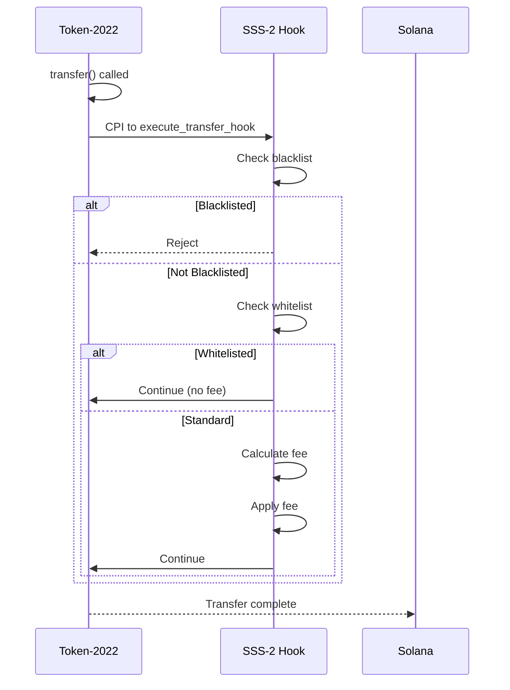
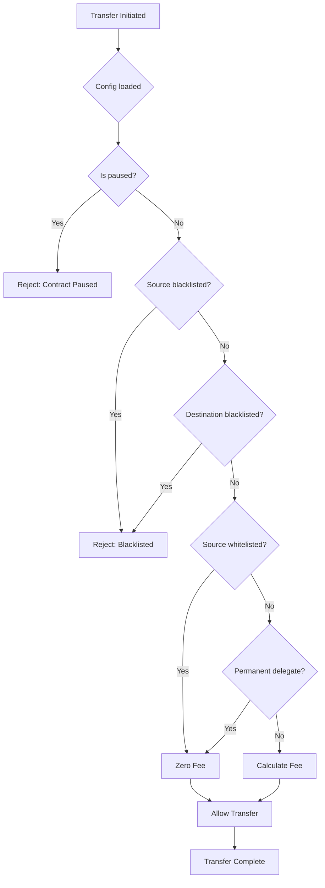

# SSS-2: Transfer Hook Compliance

## Overview

SSS-2 extends SSS-1 with advanced compliance features using Token-2022 transfer hooks. It enables fees, blacklist enforcement, seizure, and regulatory compliance.

## Features

- ✅ Transfer fees (basis points + max cap)
- ✅ Whitelist (bypass fees)
- ✅ Blacklist enforcement (block unauthorized transfers)
- ✅ Permanent delegate (bypass all restrictions)
- ✅ Seizure (recover funds from addresses)
- ✅ Emergency pause

## Architecture

### Program ID

| Network | Program ID |
|---------|------------|
| Devnet | `FSkkSmrThcLpU9Uybrn4xcpbQKswUJn7KvoUQBsLPExD` |
| Mainnet | TBD |

### Hook Flow



## Instructions

| Instruction | Description | Authority |
|-------------|-------------|-----------|
| `initialize` | Set up hook with fee config | Any |
| `execute_transfer_hook` | Hook called on every transfer | Token Program |
| `update_fee_config` | Update fees | Admin |
| `add_whitelist` | Add to whitelist | Admin |
| `remove_whitelist` | Remove from whitelist | Admin |
| `add_blacklist` | Add to blacklist | Admin |
| `remove_blacklist` | Remove from blacklist | Admin |
| `set_permanent_delegate` | Set global delegate | Admin |
| `set_blacklist_enabled` | Toggle blacklist | Admin |
| `set_paused` | Emergency pause | Admin |
| `close_config` | Close program | Admin |

## Data Structures

### TransferHookConfig
```rust
pub struct TransferHookConfig {
    pub authority: Pubkey,                    // Program authority
    pub transfer_fee_basis_points: u16,     // Fee rate (100 = 1%)
    pub max_transfer_fee: u64,               // Maximum fee cap
    pub min_transfer_amount: u64,          // Minimum transfer amount
    pub total_fees_collected: u64,          // Total fees tracked
    pub bump: u8,                           // PDA bump seed
    pub is_paused: bool,                    // Emergency pause
    pub permanent_delegate: Option<Pubkey>, // Super-admin
    pub blacklist_enabled: bool,             // Blacklist toggle
}
```

### WhitelistEntry / BlacklistEntry
```rust
pub struct ListEntry {
    pub address: Pubkey,      // The address
    pub is_active: bool,      // Entry status
    pub entry_type: ListType, // Whitelist or Blacklist
    pub created_at: i64,      // Timestamp
    pub bump: u8,             // PDA bump
}

pub enum ListType {
    Whitelist,
    Blacklist,
}
```

## Fee Calculation

### Formula

```
if amount < min_transfer_amount:
    reject("Amount too low")

if whitelisted or admin:
    fee = 0
else:
    raw_fee = (amount * basis_points) / 10000
    fee = min(raw_fee, max_transfer_fee)

net_amount = amount - fee
```

### Examples

| Amount | Fee (100 bps) | Fee (500 bps) | Max Fee (1 SOL) |
|--------|--------------|---------------|-----------------|
| 100 USDC | 0.1 USDC | 0.5 USDC | 0.1 USDC |
| 1000 USDC | 1 USDC | 5 USDC | 1 USDC |
| 10000 USDC | 10 USDC | 50 USDC | 1 USDC |

## PDAs

### Config PDA
```
seeds = ["config", authority]
bump = find_program_address(...)
```

### Whitelist PDA
```
seeds = ["whitelist", authority, address]
bump = find_program_address(...)
```

### Blacklist PDA
```
seeds = ["blacklist", authority, address]
bump = find_program_address(...)
```

## Compliance Flow

### Transfer Check Flow



## Error Codes

| Code | Error | Description |
|------|-------|-------------|
| 6000 | `FeeTooHigh` | Fee exceeds 10% cap |
| 6001 | `InvalidAuthority` | Wrong authority |
| 6002 | `AmountTooLow` | Below minimum transfer |
| 6003 | `ContractPaused` | Hook paused |
| 6004 | `AddressBlacklisted` | Address blocked |

## Events

```rust
pub struct TransferHookEvent {
    pub source: Pubkey,
    pub destination: Pubkey,
    pub amount: u64,
    pub fee: u64,
    pub is_delegate_transfer: bool,
    pub timestamp: i64,
}

pub struct FeeConfigUpdated {
    pub authority: Pubkey,
    pub transfer_fee_basis_points: u16,
    pub max_transfer_fee: u64,
    pub min_transfer_amount: u64,
    pub timestamp: i64,
}

pub struct ListEntryAdded {
    pub address: Pubkey,
    pub entry_type: ListType,
    pub added_by: Pubkey,
    pub timestamp: i64,
}

pub struct ListEntryRemoved {
    pub address: Pubkey,
    pub entry_type: ListType,
    pub removed_by: Pubkey,
    pub timestamp: i64,
}

pub struct PermanentDelegateUpdated {
    pub delegate: Option<Pubkey>,
    pub updated_by: Pubkey,
    pub timestamp: i64,
}
```

## Usage

### TypeScript SDK

```typescript
import { SSS2Hook } from '@stbr/sss-token';

const hook = new SSS2Hook(connection, payer);

// Initialize
await hook.initialize({
  transferFeeBasisPoints: 100,      // 1%
  maxTransferFee: new BN(1000000000), // 1 SOL
  minTransferAmount: new BN(1000),
  blacklistEnabled: true,
});

// Add to whitelist
await hook.addWhitelist(address);

// Add to blacklist
await hook.addBlacklist(badActorAddress);

// Set permanent delegate
await hook.setPermanentDelegate(delegatePublicKey);

// Emergency pause
await hook.setPaused(true);

// Calculate fee
const feeCalc = hook.calculateFee(amount, config);
console.log(`Fee: ${feeCalc.fee.toString()}`);
```

### CLI

```bash
# Initialize
sss-token init --preset sss-2 --fee-bps 100 --max-fee 1000000000

# Whitelist
sss-token whitelist <address>

# Blacklist
sss-token blacklist add <address>
sss-token blacklist remove <address>

# Permanent delegate
sss-token config --permanent-delegate <address>

# Pause
sss-token pause
sss-token unpause

# Seize
sss-token seize <address> --to <treasury>
```

## Testing

See [tests/sss-2/](../tests/sss-2/) for test implementations.

## Limitations

- Token-2022 required (not compatible with SPL Token)
- Requires CPI to hook program
- Higher compute cost per transfer

## Regulatory Compliance

### Freeze Authority
SSS-2 enables traditional freeze functionality plus:
- **Blacklist**: Proactive blocking
- **Seizure**: Asset recovery
- **Audit Trail**: Full event logging

### Jurisdiction Support
- Configurable compliance rules per jurisdiction
- Whitelist for KYC-verified addresses
- Emergency pause for market instability

## Migration from SSS-1

```typescript
// 1. Deploy SSS-2 program
const hook = new SSS2Hook(connection, authority);
await hook.initialize(config);

// 2. Attach hook to existing token
// (requires mint authority)
await token2022.updateMint({
  extensions: [{
    transferHook: {
      programId: SSS2_PROGRAM_ID,
    }
  }]
});

// 3. Set up compliance
await hook.addBlacklist(sanctionedAddress1);
await hook.addBlacklist(sanctionedAddress2);
await hook.addWhitelist(kycVerifiedAddress);
```

## References

- [Architecture Overview](./ARCHITECTURE.md)
- [SSS-1 Specification](./SSS-1.md)
- [SDK Documentation](./SDK.md)
- [Compliance Guide](./COMPLIANCE.md)
- [Operations Guide](./OPERATIONS.md)
