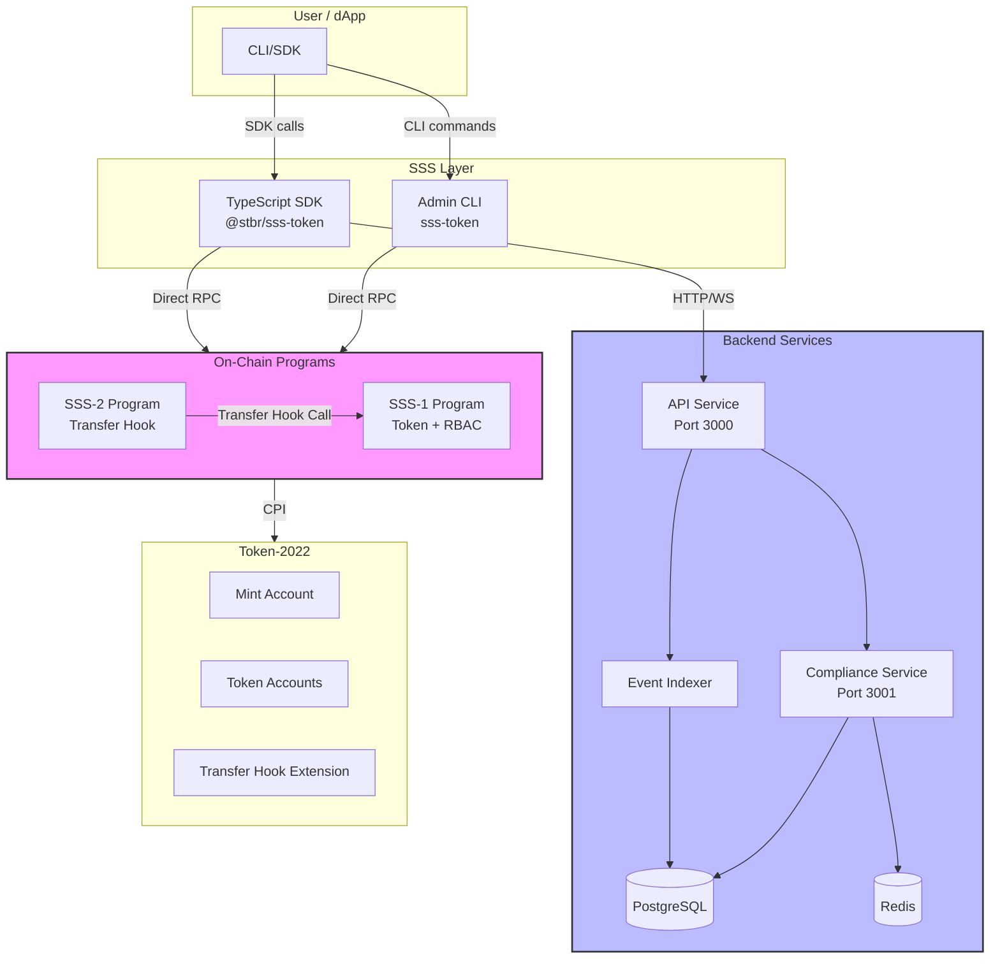
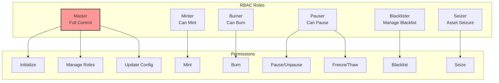
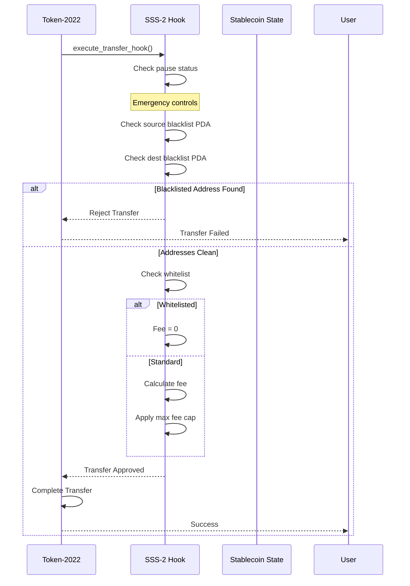

# Solana Stablecoin Standards Architecture

```mermaid
flowchart TB
    subgraph User["User / dApp"]
        U[CLI/SDK]
    end
    
    subgraph SSS["SSS Layer"]
        SDK["TypeScript SDK
        @stbr/sss-token"]
        CLI["Admin CLI
        sss-token"]
    end
    
    subgraph Backend["Backend Services"]
        API["API Service
        Port 3000"]
        IDX["Event Indexer"]
        CMP["Compliance Service
        Port 3001"]
        DB[(PostgreSQL)]
        CACHE[(Redis)]
    end
    
    subgraph OnChain["On-Chain Programs"]
        TOK["SSS-1 Program
Token + RBAC"]
        HOOK["SSS-2 Program
Transfer Hook"]
    end
    
    subgraph Token2022["Token-2022"]
        MINT[Mint Account]
        ACCT[Token Accounts]
        EXT[Transfer Hook Extension]
    end
    
    U -->|SDK calls| SDK
    U -->|CLI commands| CLI
    
    SDK -->|HTTP/WS| API
    SDK -->|Direct RPC| OnChain
    CLI -->|Direct RPC| OnChain
    
    API --> IDX
    API --> CMP
    IDX --> DB
    CMP --> CACHE
    CMP --> DB
    
    OnChain -->|CPI| Token2022
    HOOK -->|Transfer Hook Call| TOK
    
    style OnChain fill:#f9f,stroke:#333,stroke-width:2px
    style Backend fill:#bbf,stroke:#333,stroke-width:2px
```

## RBAC Role Hierarchy

```mermaid
graph TB
    subgraph Roles["RBAC Roles"]
        M[Master<br/>Full Control]
        MIN[Minter<br/>Can Mint]
        B[Burner<br/>Can Burn]
        P[Pauser<br/>Can Pause]
        BL[Blacklister<br/>Manage Blacklist]
        SZ[Seizer<br/>Asset Seizure]
    end
    
    subgraph Permissions["Permissions"]
        P1[Initialize]
        P2[Mint]
        P3[Burn]
        P4[Pause/Unpause]
        P5[Freeze/Thaw]
        P6[Update Config]
        P7[Manage Roles]
        P8[Blacklist]
        P9[Seize]
    end
    
    M --> P1
    M --> P7
    
    MIN --> P2
    B --> P3
    P --> P4
    P --> P5
    M --> P6
    BL --> P8
    SZ --> P9
    
    style M fill:#f99,stroke:#333,stroke-width:2px
```

## Transfer Hook Flow

```mermaid
sequenceDiagram
    participant T as Token-2022
    participant H as SSS-2 Hook
    participant S as Stablecoin State
    
    T->>H: execute_transfer_hook()
    
    H->>H: Check pause status
    Note over H: Emergency controls
    
    H->>H: Check source blacklist PDA
    H->>H: Check dest blacklist PDA
    
    alt Blacklisted Address Found
        H-->>T: Reject Transfer
        T-->>User: Transfer Failed
    else Addresses Clean
        H->>H: Check whitelist
        alt Whitelisted
            H->>H: Fee = 0
        else Standard
            H->>H: Calculate fee
            H->>H: Apply max fee cap
        end
        
        H-->>T: Transfer Approved
        T->>T: Complete Transfer
        T-->>User: Success
    end
```

## Component Interactions

See [SDK.md](./SDK.md) for implementation details.
